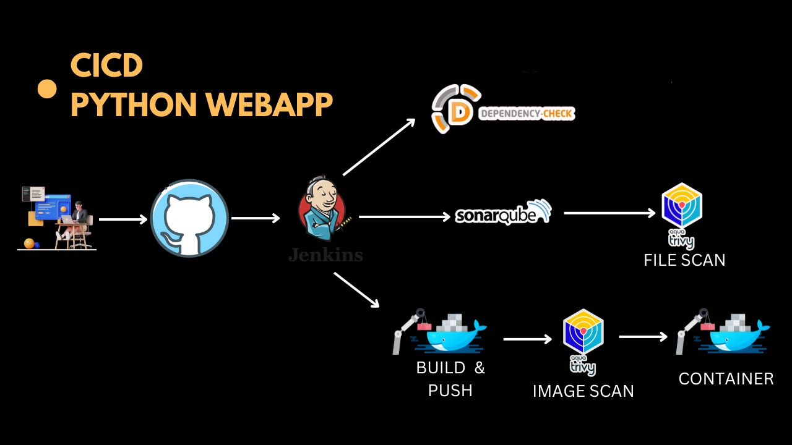

# Python Flask - Demo Web Application

This is a simple Python Flask web application. The app provides system information and a realtime monitoring screen with dials showing CPU, memory, IO and process information.

The app has been designed with cloud native demos & containers in mind, in order to provide a real working application for deployment, something more than "hello-world" but with the minimum of pre-reqs. It is not intended as a complete example of a fully functioning architecture or complex software design.

### Makefile

A standard GNU Make file is provided to help with running and building locally.

```text
help                 💬 This help message
lint                 🔎 Lint & format, will not fix but sets exit code on error
lint-fix             📜 Lint & format, will try to fix errors and modify code
image                🔨 Build container image from Dockerfile
push                 📤 Push container image to registry
run                  🏃 Run the server locally using Python & Flask
deploy               🚀 Deploy to Azure Web App
undeploy             💀 Remove from Azure
test                 🎯 Unit tests for Flask app
test-report          🎯 Unit tests for Flask app (with report output)
test-api             🚦 Run integration API tests, server must be running
clean                🧹 Clean up project
```

Make file variables and default values, pass these in when calling `make`, e.g. `make image IMAGE_REPO=blah/foo`

| Makefile Variable | Default                |
| ----------------- | ---------------------- |
| IMAGE_REG         | ghcr<span>.</span>io   |
| IMAGE_REPO        | benc-uk/python-demoapp |
| IMAGE_TAG         | latest                 |
| AZURE_RES_GROUP   | temp-demoapps          |
| AZURE_REGION      | uksouth                |
| AZURE_SITE_NAME   | pythonapp-{git-sha}    |

The app runs under Flask and listens on port 5000 by default, this can be changed with the `PORT` environmental variable.

# Containers

Public container image is [available on GitHub Container Registry](https://github.com/users/benc-uk/packages/container/package/python-demoapp)

Run in a container with:

```bash
docker run --rm -it -p 5000:5000 ghcr.io/benc-uk/python-demoapp:latest
```

Should you want to build your own container, use `make image` and the above variables to customise the name & tag.

## Kubernetes

The app can easily be deployed to Kubernetes using Helm, see [deploy/kubernetes/readme.md](deploy/kubernetes/readme.md) for details

### DevSecOps Project Diagram:



## Tools Used:

- AWS Account
- Jenkins
- Github
- SonarQube
- Trivy
- Docker & Dockerhub
- teraform (for ec2 in default vpc)

### Step 1: EC2 Setup using terraform

- Launch a t2 large Ubuntu instance in a favourite region (eg. region `us-east-1`).
- sg expose port as port for Jenkins, SonarQube and application .
- run terraform command: `terraform init,  terraform plan, terraform apply`
- after all work done infrastructure should be destroy: `terraform destroy`
- SSH into the instance from your local machine.

### Step 2: check every tools install successfully

```shell
jenkins --version
docker --version
docker ps
trivy --version
```

### Step 3: Open jenkins in browser, login and install tools

```shell
Open jenkins on port <EC2 Public_IP>:8080
administrative password : sudo cat /var/lib/jenkins/secrets/initialAdminPassword
```

### Step 9: Sonar server configuration

- Sonarqube works on Port 9000, so <Public_IP>:9000. username: admin, password: admin
- Create SonarQube token : Click on Administration ,Give a name for tocken → and click on Generate Token
- In the Sonarqube Dashboard, Create Webhook

### step 5: Set up Jenkins Plugins:

- Goto Jenkins Dashboard → Manage Jenkins → Plugins → Available Plugins

* Docker
* Docker Commons
* Docker Pipeline
* Docker API
* SonarQube Scanner
* OWASP
* Eclipse Temurin Installer (Install without restart)

### step 5: Set up Jenkins Plugins:

- Goto Jenkins Dashboard → Manage Jenkins → Tools

* Install JDK
* Dependency-Check Installation
* install a sonar scanner
* Docker Installation

### step 6: Set up credentials:

- Goto Jenkins Dashboard → Manage Jenkins → Credentials → system → Global credentials (unrestricted)→ Add username with password.
- setup credentials for dockerhub, sonar-token
- kind(username with password)->username(dockerhub username)->password(dockerhub pass)->Id(dockerHub)

### step 7: install make package

```sudo apt install make
    make -v
```

## step 8: clone github repo

`git clone https://github.com/nusratdevo/system-monitoring.git`

## step 9: build jenkins pipline

### step 10: access application on Port 5000

```<public_ip: 5000/>

```
